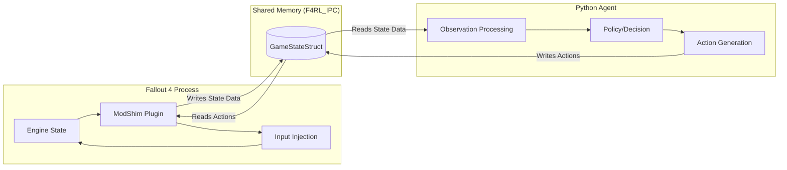

# System Architecture

The F4RL ModShim acts as a real-time bridge between the Fallout 4 game engine and an external controller (typically a Python-based AI Agent). It facilitates a low-latency, closed-loop control system by providing high-frequency state updates and receiving high-fidelity input commands.

## 🏗 System Overview

The system consists of three primary components interacting in a continuous loop:

1.  **Fallout 4 Engine (The Environment)**: The source of the simulation. It contains the game state (player position, entities, etc.).
2.  **ModShim (The Bridge)**: A C++ F4SE plugin that runs inside the game's process. It extracts data from engine memory and injects hardware-level inputs.
3.  **AI Agent (The Controller)**: An external process (e.g., Python) that processes the game state and decides on the next action.

### 🔄 The Control Loop

## 🧱 Core Components

### 1. The Data Layer (Shared Memory)
The primary communication medium is a **File-Backed Shared Memory Mapping**. 
*   **Mechanism**: The shim creates/opens a file (`F4RL_IPC`) on the host filesystem (accessible via Wine's `Z:` drive) and maps it into the process memory space of both the shim and the Python agent.
*   **Synchronization**: There is no explicit mutex-based locking between the two processes to avoid blocking the game thread. Instead, the system relies on **atomic updates** and **frame counters**.
*   **The `frame_counter`**: The shim increments a `frame_counter` every iteration. The Python agent monitors this value; a change in the counter signals that new, fresh data is available for reading.

### 2. The Extraction Layer (State Updates)
A dedicated background thread (`AgentLoop`) in the shim performs the following tasks without interrupting the main game thread:
*   **Memory Scanning**: Uses hardcoded offsets (specific to Fallout 4 version 1.10.163) to traverse engine structures.
*   **Entity Discovery**: 
    *   Scans the player's current `Cell` object list for nearby entities.
    *   Scans the global `ProcessList` for active `Actors`.
*   **Telemetry**: Extracts player coordinates (X, Y, Z), rotation (Yaw, Pitch), and health/rads/AP.

### 3. The Injection Layer (Input Control)
To ensure the game engine accepts commands as legitimate player inputs, the shim avoids high-level API calls and instead uses low-level hardware emulation:
*   **Keyboard**: Uses `keybd_event` with **DirectInput Scancodes**. This bypasss virtual key translation layers that might be intercepted or ignored by the engine.
*   **Mouse**: Uses `mouse_event` with `MOUSEEVENTF_MOVE` to simulate physical mouse movement (deltas).
*   **Console Injection**: For complex commands, the shim automates the "Tilde (~) $\to$ Type String $\to$ Enter" sequence, simulating a user typing into the developer console.

## ⚠️ Critical Design Decisions

### MinGW/MSVC Compatibility (The "Detached Thread" Strategy)
A significant challenge when compiling F4SE plugins with **MinGW** (instead of MSVC) is the mismatch in the C++ ABI, specifically regarding how virtual tables (vtables) are constructed for destructors. If the shim attempted to implement the `ITaskDelegate` interface directly, F4SE's calls to `Run()` would likely crash the game.

**Solution**: The shim implements the standard `F4SEPlugin_Load` entry point but immediately spawns a **detached background thread** to handle the logic. This thread operates independently of the F4SE-managed task queue, bypassing the ABI incompatibility issue.

### Memory Safety
Since the shim reads arbitrary memory addresses from the game engine, it uses a `SAFE_READ` macro. This macro checks if a pointer resides within a valid user-space range before attempting a dereference, significantly reducing the risk of Access Violations (crashes) during cell transitions or object destruction.