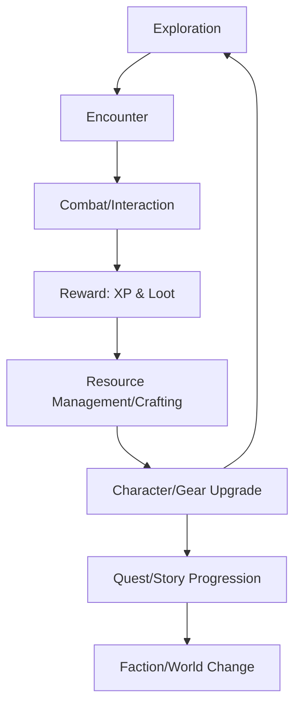

# Game Design Document: Fallout 4 Core Game Loop

## 1. Overview
This document outlines the core gameplay loops for a Fallout 4-inspired experience, focusing on the interplay between exploration, combat, resource management, and character progression.

## 2. The Core Loop (The "Moment-to-Moment" Loop)
The fundamental interaction that keeps the player engaged during active gameplay.

**Exploration $\rightarrow$ Encounter $\rightarrow$ Action $\rightarrow$ Reward**

1.  **Exploration:** The player traverses the wasteland, navigating through various environments (urban ruins, forests, etc.).
2.  **Encounter:** Proximity to enemies, interesting points of interest (POIs), or NPCs triggers an event (combat, dialogue, or discovery).
3.  **Action:** 
    *   **Combat:** Using weapons (guns, melee) to defeat hostiles.
    *   **Interaction:** Engaging in dialogue or interacting with objects.
4.  **Reward:** Receiving immediate feedback/loot:
    *   Experience Points (XP)
    *   Loot (weapons, ammo, caps, junk)
    *   Story progression/Quest updates

## 3. The Secondary Loop (The "Session" Loop)
The loop that drives the player to return to the game and engage with deeper systems.

**Looting $\rightarrow$ Scavenging $\rightarrow$ Upgrading $\rightarrow$ Power Increase**

1.  **Looting/Scavenging:** Collecting "Junk" and resources from the environment.
2.  **Crafting/Upgrading:** Using gathered resources and weapons/armor at workbenches to create better gear or modify existing equipment.

3.  **Character Progression:** Using accumulated XP to level up and select new Perks.
4.  **Power Increase:** Improved gear and better skills allow the player to tackle more dangerous areas and tougher enemies, resetting the loop back to higher-tier Exploration.

## 4. The Meta Loop (The "Long-Term" Loop)
The overarching narrative and structural progression.

**Questing $\rightarrow$ Faction Influence $\rightarrow$ World Change $\rightarrow$ End Game**

1.  **Questing:** Completing main and side quests to drive the narrative forward.
2.  **Faction Standing:** Choices made during quests affect the player's reputation with different factions (Brotherhood of Steel, Railroad, etc.).
3.  **World Impact:** Changing the state of the world through quest outcomes and settlement management.
4.  **End Game:** Reaching the pinnacle of power, mastering all skill trees, and determining the ultimate fate of the wasteland.

## 5. Summary Diagram

## 6. AI Training Relevance (Movement & Combat)

For the purpose of training Movement and Combat AI, the following segments of the game loop are primary focus areas:

### 1. The "Encounter" Trigger (State Transition)
*   **Input/Observation:** Detection of enemy presence via proximity, line-of-sight, or sound.
*   **AI Objective:** Efficiently transitioning from an "Exploration" state to a "Combat" state by positioning optimally.

### 2. The "Action" Phase (Core Combat Mechanics)
This is the most critical area for Reinforcement Learning (RL) or Behavioral Cloning (BC) agents.
*   **Movement (Kinematics & Navigation):**
    *   **Obstacle Avoidance:** Navigating terrain and debris during combat.
    *   **Positioning/Strafe:** Maintaining distance (kiting) or closing the gap (melee).
    *   **Cover Utilization:** Identifying and moving towards low-exposure positions.
*   **Combat (Decision Making):**
    *   **Target Selection:** Prioritizing high-threat enemies vs. low-threat targets.
    *   **Weapon Usage:** Selecting the appropriate tool for the engagement range.
    *   **Resource Management (Ammo/Health):** Deciding when to retreat or use consumables.

### 3. The "Reward" Function (Optimization Goal)
The reward signal for the AI should be derived from the "Reward" step of the core loop:
*   **Positive Rewards:** Enemy kills (XP), successful loot acquisition, staying alive (survival duration), minimizing damage taken.
*   **Negative Rewards (Penalties):** Taking damage, losing health, failing to neutralize threats, inefficient movement (stalling).

### 4. The "Exploration" Context (Environmental Awareness)
*   **Map Awareness:** Understanding the traversability of the environment to avoid getting trapped during an encounter.
*   **Pathfinding:** Integration with navigation meshes (NavMesh) to ensure smooth movement between POIs (Points of Interest).

## 7. Implementation Mapping (GDD to `ipc_schema.py`)

To bridge the high-level game loop with our technical implementation, the following mappings have been established within the `GameStateStruct`:

| GDD Concept | `ipc_schema.py` Data/Fields | Implementation Note |
| :--- | :--- | :--- |
| **Encounter Detection** | `entities` (EntityData: `x, y, z`, `typeId`) | Agent calculates proximity and threat based on the coordinates of nearby entities. |
| **Movement/Positioning** | `player_x, y, z`, `player_yaw, pitch`, `delta_yaw, pitch`, `jump` | The agent uses current position and orientation to execute strafing, kiting, and obstacle avoidance. |
| **Combat Execution** | `click_lmb`, `click_rmb` | Input signals for weapon discharge and target acquisition/aiming. |
| **Interaction** | `press_e` | Triggering interaction events (e.g., looting, opening doors) identified in the "Action" phase. |
| **Survival Reward/Penalty** | `player_health`, `player_rads` | Primary negative reward signals (damage taken/radiation exposure). |
| **Pathfinding/Navigation** | `waypoints` (WaypointData: `x, y, z`) | High-level navigation guidance for the agent to traverse the environment. |
| **Action/State Transition** | `discrete_action` | Mapping high-level decision-making (e.format: Combat $\leftrightarrow$ Exploration) into discrete commandable actions. |
